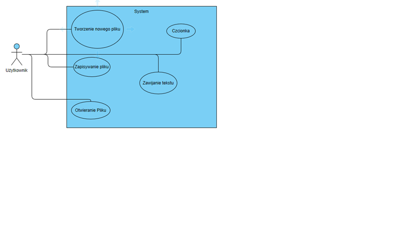

#Notatnik

**Spis treści**
 1. [Opis](#opis)
 2. [Instalacja](#Instalacja)
 3. [Sposób użycia](#sposób-użycia)
 4. [Preferencje do współpracy](#preferencje-do-współpracy)
 5. [Autor](#autor)

## Opis
Aplikacja ma umożliwiać  archiwizowanie danych 
System ma służyć do zapisywania notatek tworzenia listy oraz 
otwierania plików z rozszerzeniem „txt” oraz „php”.
Możemy także edytować  nasze pliki poprzez funkcje takie jak:
formatuj tekst,ustaw czcionkę.Posiadają one szeroki 
wachlarz funkcjonalności.Kolejną zadowalającą cechą
jest możliwość tworzenia nowych plików, oraz  zapisu 
danych w dowolnym miejscu na komputerze z rozszerzeniem 
„txt” oraz „php”.Wbudowana funkcjonalność zawijania tekstu ułatwia 
pracę podczas pisania wielo liniowego kodu,opowiadania,wypracowania.
Dodatkową jak i ostatnia funkcjonalnością programu jest możliwość z poziomu 
aplikacji przejście na stronę internetową która w sposób szczegółowy opisuje historie programu.

## Instalacja
Aplikacja nie wymaga instalowania aby uruchomić program należy kliknąć dwukrotnie
w ikonę „projekt1.exe” po czym aplikacja zostanie wprowadzona w proces uruchamiania
i będzie gotowa do pracy.

## Sposób użycia
Tworzenie nowego pliku odbywa się poprzez kliknięcie w zakładkę PLIK->NOWY 
Następnie wyświetla nam się okno powiadomień z wiadomością:
 „Czy na pewno chcesz utworzyć nowy obiekt”
 
Funkcja otwierania pliku: odbywa się poprzez Plik->Otwórz
 
Mamy możliwość otwarcia nie tylko plików „txt” lecz także „html”,”php”

Funkcja Zapisz jako posiada rozbudowaną funkcję zapisu w trzech 
Rozszerzeniach m.i.n („txt,php,html”)
 
Aby ustawić funkcję zawijania tekstu lub  gdy otwieramy plik w którym chcemy użyć 
zawijania tekstu przechodzimy w zakładkę Format->Zawijanie tekstu
 
Ostatnią funkcją programu jest możliwość zmienienia : („Font,Font_style,size,Effects,color,script”)
Aby wejść w tą funkcjonalność należy kliknąć w zakładkę Format->Czcionka
 

## Preferencje do współpracy
 Mwojdyla0@gmail.com

### Diagram przypadków użycia

## Autor 
Marek Wojdyła

